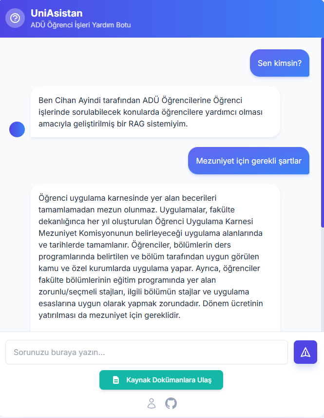
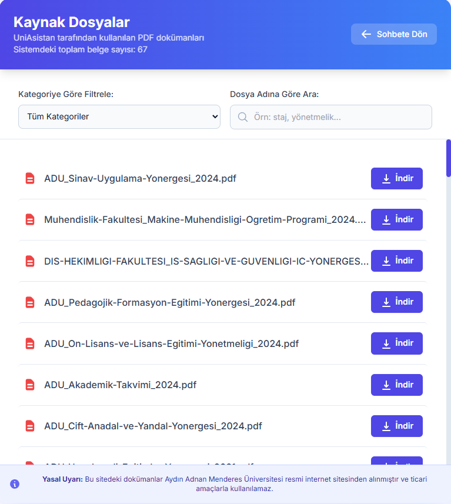
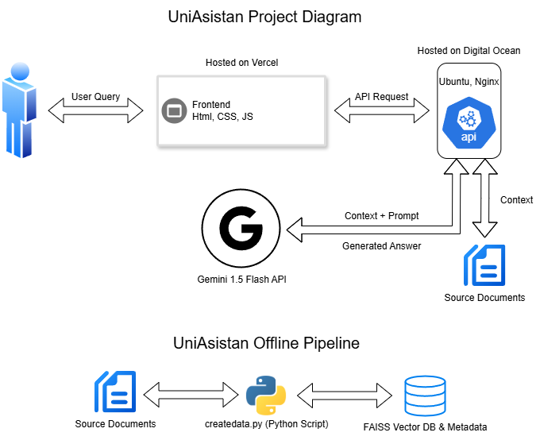

# UniAsistan - RAG-Based Chatbot for Adnan Menderes University

<table align="center">
  <tr>
    <td align="center"><strong>Sohbet Arayüzü</strong></td>
    <td align="center"><strong>Kaynaklar Sayfası</strong></td>
  </tr>
  <tr>
    <td></td>
    <td></td>
  </tr>
</table>

**Live Demo:** [UniAsistan Chat Interface](https://uniasistan.vercel.app/)

---

## 🚀 About The Project

**UniAsistan** is an AI-powered chatbot developed to answer students' questions about student affairs and regulations at Adnan Menderes University (ADÜ), based on the university's official documents.

As a 4th-year Computer Engineering student, I developed this portfolio project to gain hands-on experience with modern AI architectures and end-to-end system development processes. This project covers the entire lifecycle of an idea, from concept through development to live deployment, rather than just training a model.

### ✨ Key Competencies and Processes
The core skills developed during this project include:

- **End-to-End Project Development:** Managing the entire process from an idea to a live application.
- **Modern AI Architecture (RAG):** Designing and implementing a Retrieval-Augmented Generation (RAG) system that produces reliable, source-based answers.
- **Decoupled Architecture:** Independently developing and deploying Frontend and Backend services on different platforms (Vercel & DigitalOcean).
- **Cloud and Server Management (DevOps):**
  - Configuring a Linux server (Ubuntu 22.04) from scratch on a **DigitalOcean Droplet (VDS)**.
  - Setting up **Nginx** as a reverse proxy to securely expose the API server to the internet via a custom domain.
  - Overcoming deployment challenges, such as migrating from `fly.io` (PaaS) to DigitalOcean (IaaS) due to platform limitations.
- **API Development and Integration:**
  - Developing a high-performance, asynchronous REST API with **FastAPI**.
  - Creating a layered service architecture where the developed API communicates with an external AI API, **Google Gemini 1.5 Flash**.

---

## 🛠️ Technology Architecture and Stack

The project is built on a modern, decoupled architecture where the frontend and backend are separate.



### Technology Stack

| Area                 | Technologies                                                                                              |
| -------------------- | --------------------------------------------------------------------------------------------------------- |
| **Backend** | `Python`, `FastAPI`, `Uvicorn`, `Sentence-Transformers`, `FAISS`, `LangChain`, `Google Generative AI (Gemini)` |
| **Frontend** | `HTML5`, `Tailwind CSS`, `Vanilla JavaScript`                                                             |
| **Database** | `FAISS` (Vector Database)                                                                                 |
| **Deployment** | **Backend:** `DigitalOcean Droplet (Ubuntu 22.04)`, `Nginx`, `Gunicorn` <br> **Frontend:** `Vercel`        |


---

## ⚙️ How It Works

UniAsistan uses the **Retrieval-Augmented Generation (RAG)** architecture. This approach prevents the language model from "hallucinating" (making up information) by ensuring that its answers are based only on the information provided in the system's documents.

### Phase 1: Data Indexing (Offline)
This process is run once using the `veriolustur.py` script.
1.  **PDF Parsing:** All PDFs in the `source_documents` folder are read, and their text is extracted.
2.  **Chunking:** Long texts are split into smaller, meaningful chunks using `LangChain`.
3.  **Vectorization (Embedding):** Each text chunk is converted into a semantic vector using the `SentenceTransformer` model.
4.  **Indexing:** These vectors are indexed in a `FAISS` database (`faiss_index.bin`) for fast retrieval.

### Phase 2: Question Answering (Online)
When a user asks a question, the API running on `main.py` (FastAPI) follows these steps:
1.  **Query Vectorization:** The user's question is converted into a vector using the same model.
2.  **Similarity Search:** The FAISS database is searched to find the most similar text chunks (context) to the question vector. The results are re-ranked using the `MMR (Maximal Marginal Relevance)` algorithm for diversity and relevance.
3.  **Prompt Engineering:** The retrieved text chunks and the user's question are placed into a carefully crafted prompt template.
4.  **Answer Generation:** This template is sent to the **Google Gemini 1.5 Flash API**, which is instructed to generate an answer based only on the provided context.
5.  **Return Response:** The generated answer and the source documents it was based on are sent back to the frontend in JSON format.

---

## 🚀 Local Setup and Running

You can follow the steps below to try the project on your local machine.

### Prerequisites
- Python 3.9+
- Git

### Installation Steps

1.  **Clone the repository:**
    ```bash
    git clone [https://github.com/cihanayindi/UniAsistan.git](https://github.com/cihanayindi/UniAsistan.git)
    cd UniAsistan
    ```

2.  **Create and activate a Python virtual environment:**
    ```bash
    python -m venv venv
    # For Windows
    venv\Scripts\activate
    # For macOS/Linux
    source venv/bin/activate
    ```

3.  **Install the required libraries:**
    ```bash
    pip install -r requirements.txt
    ```

4.  **Set up environment variables:**
    - Create a file named `.env` in the project's root directory.
    - Add your Google Gemini API key to it:
      ```
      GEMINI_API_KEY="AIzaSy...YOUR_API_KEY"
      ```

5.  **Run the data indexing script:**
    - Add your own PDFs to the `source_documents` folder.
    - Run the following command to create the database:
      ```bash
      python veriolustur.py
      ```
    - This process will create `faiss_index.bin` and `chunks_metadata.json` files inside the `data` folder.

6.  **Start the backend API server:**
    ```bash
    uvicorn main:app --reload
    ```
    The server will run at `http://127.0.0.1:8000` by default.

7.  **Open the frontend:**
    - Open the `index.html` file directly in your browser by double-clicking it.
    - You can now use the chatbot!

---

## ✍️ About the Developer

I'm Cihan Ayindi, a 4th-year Computer Engineering student passionate about Artificial Intelligence, cloud systems, and full-stack web development.

- **Portfolio:** [www.cihanayindi.com](https://www.cihanayindi.com)
- **GitHub:** [@cihanayindi](https://github.com/cihanayindi)
- **LinkedIn:** [cihanayindi](https://www.linkedin.com/in/cihanayindi/)
